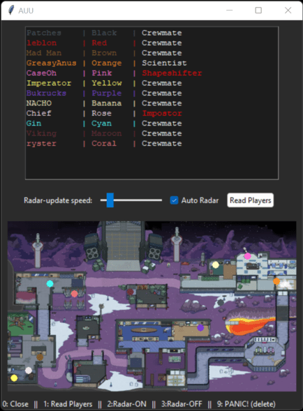
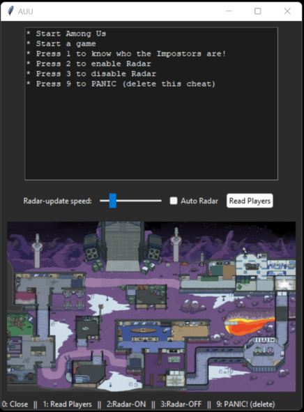

# Among-Us-read-Player
## Undetectable among us Cheat!

## Here's how I did it!

### Use Cheat Engine

1. Link **"Among Us.exe"**.
2. Click on **Mono** in the toolbar up top -> Activate **Mono Features**.
   - Click on **Dissect Mono** - you will see all the DLL modules in the Among Us game.
   - Pick **Assembly-CSharp.dll**.
3. Right-click **AmongUsClient** and click on **Find instances of class**.
4. (Again) Right-click **AmongUsClient** and click on **Data structures** -> **Dissect Data Structure**.
   - You will see all the data structure instances pop up. Only one of them is the real one (it's better to be in a game).
5. To find the correct data structure:
   - Expand them one by one and look at the timer. Right values are **0/0.013/0.033/0.066/0.099**.
   - Anything with **E-XX** at the end of the number is wrong (too small).
   - Once you find the correct data structure, copy its address into the **Dissect Struct** that you've opened before.
   - That structure should contain all game data! You can find **player names, roles, XY location**, and other info there.
6. Now that we found one instance of that class, we need to find the correct pointer.
   - For the current game version, it's `"GameAssembly.dll" + 5C`, but here’s how to get it if the game updates.
7. Copy the class address into **Cheat Engine table**, then find the pointers.
   - Once you find and save your pointers, redo the whole process until you have a smaller set of pointers and pick one to work with.
8. Now we found the correct pointer! **WOO HOO!**
   - Time to create our cheat!
   
> **Note:** Most anti-cheats now look for a process linked to the Among Us game or check if you have an injected DLL in the Among Us folder, which we **do not** want, as that's how you get caught.

### Instead:
- We will **just read the data** we want from memory and display it!

